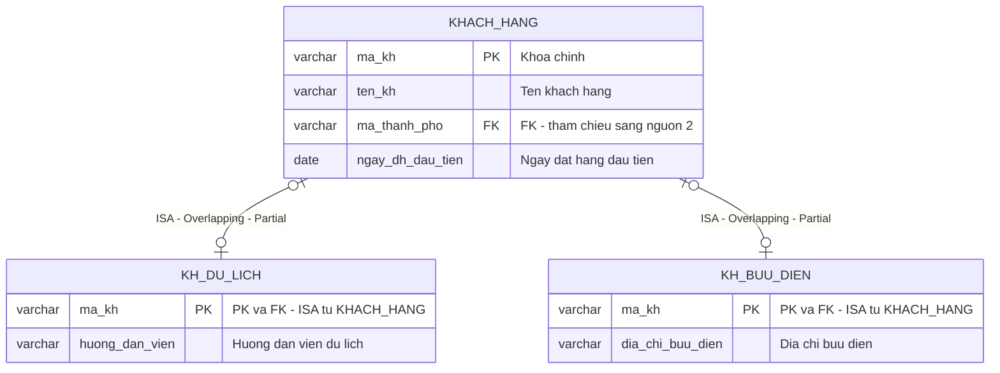
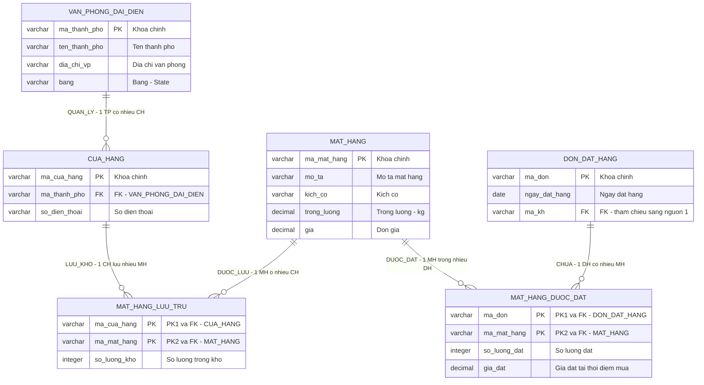
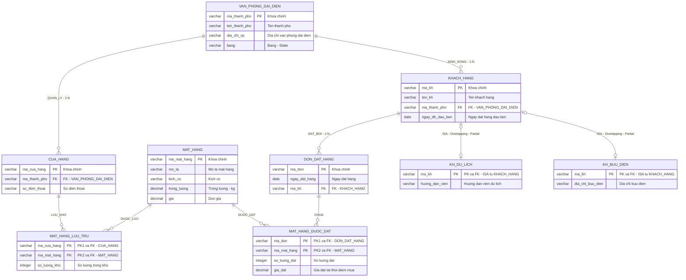

# Sơ đồ ER – Bước 1: Tích hợp dữ liệu

> **Phiên bản**: v2 – Đã fix các lỗi từ đánh giá (ISA notation, bỏ surrogate ID, cardinality chính xác)

## 1. ER1 – CSDL Văn phòng đại diện (Nguồn 1)

Nguồn gốc: 3 bảng quan hệ → chuyển đổi ngược sang mô hình ER.

### Sơ đồ ER1

### Phân tích ER1

- **KHACH_HANG** là **supertype** (thực thể cha)
- **KH_DU_LICH** và **KH_BUU_DIEN** là **subtype** (thực thể con) – quan hệ **ISA**
- **Chuyên biệt hóa**:
  - **Overlapping**: 1 KH có thể thuộc cả "Du lịch" lẫn "Bưu điện"
  - **Partial**: 1 KH có thể không thuộc loại nào (chỉ là KH thường)
- **Cardinality**: 1:0..1 (optional) – mỗi KH có **tối đa 1** bản ghi ở mỗi subtype, có thể **không có**
- FK `ma_thanh_pho` tham chiếu sang nguồn 2 (sẽ được tích hợp ở IER)
- **Không có surrogate ID** – dùng `ma_kh` làm business key / PK gốc

---

## 2. ER2 – CSDL Bán hàng (Nguồn 2)

Nguồn gốc: 6 bảng quan hệ → chuyển đổi ngược sang mô hình ER.

### Sơ đồ ER2

### Phân tích ER2

- **4 thực thể mạnh**: VAN_PHONG_DAI_DIEN, CUA_HANG, MAT_HANG, DON_DAT_HANG
- **2 bảng liên kết** (thể hiện quan hệ M:N):
  - `MAT_HANG_LUU_TRU`: CUA_HANG ↔ MAT_HANG – PK gộp (ma_cua_hang, ma_mat_hang)
  - `MAT_HANG_DUOC_DAT`: DON_DAT_HANG ↔ MAT_HANG – PK gộp (ma_don, ma_mat_hang)
- FK `ma_kh` trong DON_DAT_HANG tham chiếu sang **nguồn 1** (cross-reference)
- **Không có surrogate ID** – tất cả dùng business key gốc

---

## 3. IER – Mô hình ER tích hợp

Kết quả tích hợp ER1 + ER2 thành mô hình ER tích hợp duy nhất.

### 3.1 Phân tích & giải quyết xung đột

| Loại xung đột | Chi tiết | Cách giải quyết |
|---------------|----------|-----------------|
| **Naming** | `ma_thanh_pho` dùng ở cả KHACH_HANG (nguồn 1) và VAN_PHONG_DAI_DIEN (nguồn 2) | Xác định cùng tham chiếu 1 thực thể → gộp thành FK |
| **Structural** | KH (nguồn 1) chỉ có FK `ma_thanh_pho`, nhưng thông tin chi tiết TP nằm ở VPĐD (nguồn 2) | Tạo quan hệ SINH_SỐNG: KHACH_HANG → VAN_PHONG_DAI_DIEN |
| **Cross-reference** | ĐƠN_HÀNG (nguồn 2) có FK `ma_kh` tham chiếu KHACH_HANG (nguồn 1) | Tạo quan hệ ĐẶT_BỞI: DON_DAT_HANG → KHACH_HANG |
| **Thuộc tính Thời gian** | Xuất hiện ở hầu hết bảng nguồn, dùng cho SCD | Loại bỏ khỏi IER (xử lý bằng Time Dimension ở DW) |

### 3.2 Sơ đồ IER

### 3.3 Danh sách thực thể & mối quan hệ IER

**Thực thể (7 entity + 2 bảng liên kết):**

| # | Thực thể | PK | Thuộc tính | Ghi chú |
|---|----------|-----|-----------|---------|
| 1 | VAN_PHONG_DAI_DIEN | ma_thanh_pho | ten_thanh_pho, dia_chi_vp, bang | Đại diện cho Thành phố |
| 2 | CUA_HANG | ma_cua_hang | so_dien_thoai | FK → VPĐD |
| 3 | MAT_HANG | ma_mat_hang | mo_ta, kich_co, trong_luong, gia | – |
| 4 | KHACH_HANG | ma_kh | ten_kh, ngay_dh_dau_tien | FK → VPĐD (supertype) |
| 5 | KH_DU_LICH | ma_kh | huong_dan_vien | **Subtype ISA** ← KHACH_HANG |
| 6 | KH_BUU_DIEN | ma_kh | dia_chi_buu_dien | **Subtype ISA** ← KHACH_HANG |
| 7 | DON_DAT_HANG | ma_don | ngay_dat_hang | FK → KHACH_HANG |

**Bảng liên kết (2):**

| # | Bảng | PK gộp | Thuộc tính | Quan hệ |
|---|------|--------|-----------|---------|
| 1 | MAT_HANG_LUU_TRU | (ma_cua_hang, ma_mat_hang) | so_luong_kho | CUA_HANG ↔ MAT_HANG (M:N) |
| 2 | MAT_HANG_DUOC_DAT | (ma_don, ma_mat_hang) | so_luong_dat, gia_dat | DON_DAT_HANG ↔ MAT_HANG (M:N) |

**Mối quan hệ (5):**

| # | Tên quan hệ | Giữa | Bậc | Thuộc tính quan hệ |
|---|-------------|------|-----|---------------------|
| 1 | QUẢN_LÝ | VPĐD – CỬA_HÀNG | 1:N | – |
| 2 | SINH_SỐNG | VPĐD – KHÁCH_HÀNG | 1:N | – |
| 3 | ĐẶT_BỞI | KHÁCH_HÀNG – ĐƠN_HÀNG | 1:N | – |
| 4 | LƯU_KHO | CỬA_HÀNG – MẶT_HÀNG | M:N | so_luong_kho |
| 5 | ĐƯỢC_ĐẶT | ĐƠN_HÀNG – MẶT_HÀNG | M:N | so_luong_dat, gia_dat |

**Chuyên biệt hóa (1):**

| Supertype | Subtypes | Kiểu | Ràng buộc | Ghi chú |
|-----------|----------|------|-----------|---------|
| KHACH_HANG | KH_DU_LICH, KH_BUU_DIEN | **Overlapping** | **Partial** | 1 KH có thể thuộc cả 2 loại hoặc không thuộc loại nào |

### 3.4 Các thay đổi so với phiên bản v1

| # | Thay đổi | Lý do |
|---|----------|-------|
| 1 | ❌ Bỏ cột `id` surrogate trong tất cả entity | Mô hình ER dùng business key gốc, surrogate key chỉ thêm khi cài đặt CSDL |
| 2 | ✅ ISA notation rõ ràng: `\|o--o\|` + label "ISA - Overlapping - Partial" | Thể hiện đúng chuyên biệt hóa theo chuẩn ER |
| 3 | ✅ Cardinality ISA: `0..1` (optional) thay vì  `1:1` (mandatory) | KH có thể không thuộc subtype nào |
| 4 | ✅ Ghi chú PK gộp cho bảng liên kết | Rõ ràng hơn composite PK |
| 5 | ✅ Comment tiếng Việt không dấu trong Mermaid | Tránh lỗi render ký tự đặc biệt |
