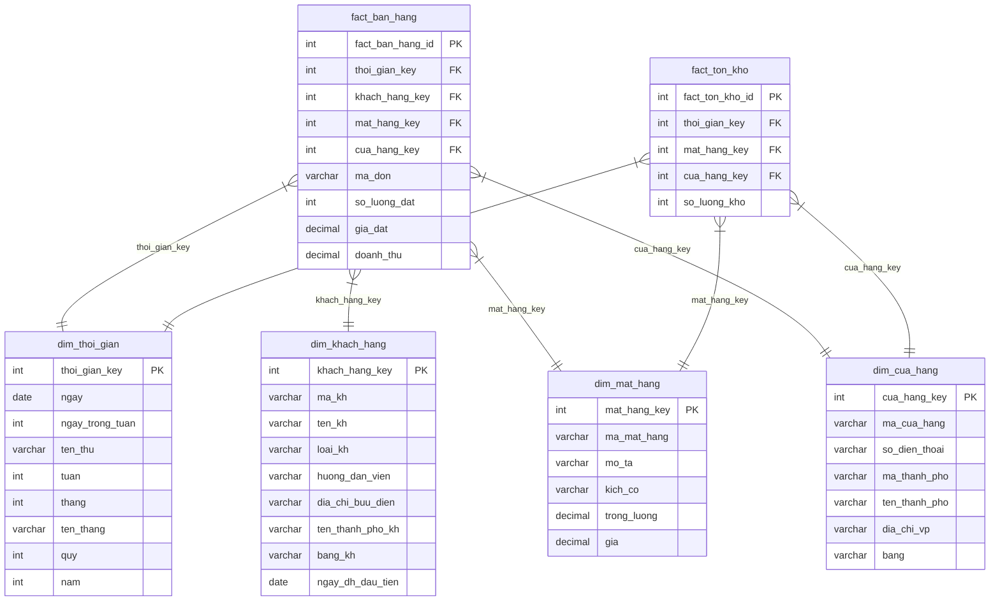
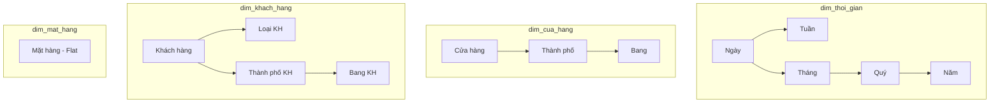

# Thiết kế Star Schema – Kho dữ liệu INT1422

## 1. Tổng quan

Kho dữ liệu sử dụng **2 Fact tables** và **4 Dimension tables** theo mô hình lược đồ hình sao (Star Schema).

### Grain (Độ chi tiết)
- **Fact Bán hàng**: 1 dòng = 1 mặt hàng trong 1 đơn đặt hàng
- **Fact Tồn kho**: 1 dòng = 1 mặt hàng × 1 cửa hàng × 1 thời điểm

---

## 2. Star Schema Diagram

---

## 3. Chi tiết bảng Fact

### 3.1 fact_ban_hang (Transaction Fact)

| Cột | Kiểu | Loại | Mô tả |
|-----|------|------|-------|
| fact_ban_hang_id | SERIAL | PK | Surrogate key |
| thoi_gian_key | INT | FK | → dim_thoi_gian (từ ngày đặt hàng) |
| khach_hang_key | INT | FK | → dim_khach_hang |
| mat_hang_key | INT | FK | → dim_mat_hang |
| cua_hang_key | INT | FK | → dim_cua_hang (CH phục vụ đơn) |
| ma_don | VARCHAR | DD | Degenerate Dimension (mã đơn hàng) |
| **so_luong_dat** | INT | **Measure** | Số lượng đặt |
| **gia_dat** | DECIMAL | **Measure** | Giá đặt (đơn giá tại thời điểm mua) |
| **doanh_thu** | DECIMAL | **Measure** | = so_luong_dat × gia_dat |

### 3.2 fact_ton_kho (Periodic Snapshot Fact)

| Cột | Kiểu | Loại | Mô tả |
|-----|------|------|-------|
| fact_ton_kho_id | SERIAL | PK | Surrogate key |
| thoi_gian_key | INT | FK | → dim_thoi_gian (thời điểm snapshot) |
| mat_hang_key | INT | FK | → dim_mat_hang |
| cua_hang_key | INT | FK | → dim_cua_hang |
| **so_luong_kho** | INT | **Measure** | SL tồn kho tại thời điểm |

---

## 4. Chi tiết bảng Dimension

### 4.1 dim_thoi_gian (Time Dimension)

| Cột | Kiểu | Mô tả | Ví dụ |
|-----|------|-------|-------|
| thoi_gian_key | SERIAL PK | Surrogate key | 1 |
| ngay | DATE | Ngày đầy đủ | 2024-01-15 |
| ngay_trong_tuan | INT | 1(CN) – 7(T7) | 2 |
| ten_thu | VARCHAR | Tên thứ | Thứ Hai |
| tuan | INT | Tuần trong năm | 3 |
| thang | INT | Tháng | 1 |
| ten_thang | VARCHAR | Tên tháng | Tháng 1 |
| quy | INT | Quý | 1 |
| nam | INT | Năm | 2024 |

**Hierarchy**: `Ngày → Tuần → Tháng → Quý → Năm`

### 4.2 dim_khach_hang (Customer Dimension)

| Cột | Kiểu | Mô tả | Ví dụ |
|-----|------|-------|-------|
| khach_hang_key | SERIAL PK | Surrogate key | 1 |
| ma_kh | VARCHAR | Business key | KH01 |
| ten_kh | VARCHAR | Tên KH | Nguyễn Văn An |
| loai_kh | VARCHAR | Loại KH (flatten ISA) | 'Cả hai' |
| huong_dan_vien | VARCHAR | HDV (NULL nếu không) | Nguyễn HDV A |
| dia_chi_buu_dien | VARCHAR | Địa chỉ BĐ (NULL nếu không) | 10 Phố Huế... |
| ten_thanh_pho_kh | VARCHAR | TP sinh sống | Hà Nội |
| bang_kh | VARCHAR | Bang | Miền Bắc |
| ngay_dh_dau_tien | DATE | Ngày ĐH đầu tiên | 2024-01-15 |

**Hierarchy**: `Khách hàng → Loại KH` và `Khách hàng → Thành phố → Bang`

**Giá trị `loai_kh`**: 'Du lịch', 'Bưu điện', 'Cả hai', 'Thường'

### 4.3 dim_mat_hang (Product Dimension)

| Cột | Kiểu | Mô tả | Ví dụ |
|-----|------|-------|-------|
| mat_hang_key | SERIAL PK | Surrogate key | 1 |
| ma_mat_hang | VARCHAR | Business key | MH01 |
| mo_ta | VARCHAR | Mô tả | Áo thun nam cổ tròn |
| kich_co | VARCHAR | Kích cỡ | M |
| trong_luong | DECIMAL | Trọng lượng (kg) | 0.20 |
| gia | DECIMAL | Đơn giá | 150000.00 |

**Hierarchy**: Flat (không có phân cấp)

### 4.4 dim_cua_hang (Store Dimension)

| Cột | Kiểu | Mô tả | Ví dụ |
|-----|------|-------|-------|
| cua_hang_key | SERIAL PK | Surrogate key | 1 |
| ma_cua_hang | VARCHAR | Business key | CH01 |
| so_dien_thoai | VARCHAR | SĐT | 024-3825-1111 |
| ma_thanh_pho | VARCHAR | Mã TP | TP01 |
| ten_thanh_pho | VARCHAR | Tên TP | Hà Nội |
| dia_chi_vp | VARCHAR | Địa chỉ VPĐD | 123 Trần Hưng Đạo |
| bang | VARCHAR | Bang | Miền Bắc |

**Hierarchy**: `Cửa hàng → Thành phố → Bang`

---

## 5. Phân cấp (Hierarchies)

---

## 6. Coverage 9 truy vấn OLAP

| Q | Mô tả ngắn | Fact | Dimensions |
|---|------------|------|------------|
| 1 | CH + MH bán ở kho | fact_ton_kho | dim_cua_hang, dim_mat_hang |
| 2 | ĐH + KH + ngày | fact_ban_hang | dim_khach_hang, dim_thoi_gian |
| 3 | CH bán MH đặt bởi KH | fact_ban_hang | dim_khach_hang, dim_mat_hang, dim_cua_hang |
| 4 | VPĐD có kho MH > ngưỡng | fact_ton_kho | dim_cua_hang, dim_mat_hang |
| 5 | MH đặt + CH bán | fact_ban_hang + fact_ton_kho | dim_mat_hang, dim_cua_hang |
| 6 | TP + Bang KH | – | dim_khach_hang |
| 7 | Tồn kho MH tại TP | fact_ton_kho | dim_mat_hang, dim_cua_hang |
| 8 | Chi tiết đơn hàng | fact_ban_hang | all 4 dims |
| 9 | Loại KH | – | dim_khach_hang (loai_kh) |
