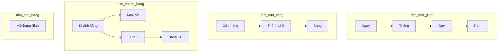

# Thiết kế phân cấp (Hierarchy) – OLAP

## 1. Tổng quan

Phân cấp (Hierarchy) xác định cách dữ liệu có thể được **Roll Up** (tổng hợp lên cấp cao hơn) hoặc **Drill Down** (chi tiết xuống cấp thấp hơn) trên mỗi Dimension.

---

## 2. Hierarchy cho từng Dimension

### 2.1 dim_thoi_gian – Time Hierarchy

```
                    ┌─────┐
                    │ Năm │         Level 4 (cao nhất)
                    └──┬──┘
                       │
                    ┌──┴──┐
                    │ Quý │         Level 3
                    └──┬──┘
                       │
                  ┌────┴────┐
                  │  Tháng  │       Level 2
                  └────┬────┘
                       │
                  ┌────┴────┐
                  │  Ngày   │       Level 1 (chi tiết nhất)
                  └─────────┘
```

| Level | Cột | Kiểu | Ví dụ | Aggregation |
|-------|-----|------|-------|-------------|
| 1 | ngay | DATE | 2024-01-15 | Base level |
| 2 | thang, ten_thang | INT, VARCHAR | 1, "Tháng 1" | SUM theo tháng |
| 3 | quy | INT | 1 | SUM theo quý |
| 4 | nam | INT | 2024 | SUM theo năm |

**Nhánh phụ**: ngay → tuan (tuần trong năm), ngay → ngay_trong_tuan, ten_thu

**Ví dụ Roll Up**: Doanh thu ngày 15/01 → Doanh thu Tháng 1 → Doanh thu Quý 1 → Doanh thu Năm 2024

---

### 2.2 dim_cua_hang – Location Hierarchy

```
                  ┌──────────┐
                  │   Bang   │       Level 3 (cao nhất)
                  └────┬─────┘
                       │
               ┌───────┴───────┐
               │  Thành phố   │    Level 2
               └───────┬───────┘
                       │
               ┌───────┴───────┐
               │  Cửa hàng    │    Level 1 (chi tiết nhất)
               └───────────────┘
```

| Level | Cột | Kiểu | Ví dụ | Aggregation |
|-------|-----|------|-------|-------------|
| 1 | ma_cua_hang, so_dien_thoai | VARCHAR | CH01, 024-... | Base level |
| 2 | ma_thanh_pho, ten_thanh_pho, dia_chi_vp | VARCHAR | TP01, Hà Nội | SUM theo TP |
| 3 | bang | VARCHAR | Miền Bắc | SUM theo Bang |

**Ví dụ Roll Up**: Tồn kho CH01 → Tồn kho Hà Nội → Tồn kho Miền Bắc

---

### 2.3 dim_khach_hang – Customer Hierarchies (2 nhánh)

**Nhánh 1: Theo loại KH**
```
               ┌──────────┐
               │ Loại KH  │       Level 2
               └────┬─────┘
                    │
               ┌────┴─────┐
               │ Khách hàng│      Level 1
               └──────────┘
```

| Level | Cột | Ví dụ | Aggregation |
|-------|-----|-------|-------------|
| 1 | ma_kh, ten_kh | KH01, Nguyễn Văn An | Base level |
| 2 | loai_kh | Du lịch / Bưu điện / Cả hai / Thường | COUNT/SUM theo loại |

**Nhánh 2: Theo địa lý KH**
```
                  ┌──────────┐
                  │  Bang KH │       Level 3
                  └────┬─────┘
                       │
               ┌───────┴───────┐
               │   TP KH      │    Level 2
               └───────┬───────┘
                       │
               ┌───────┴───────┐
               │  Khách hàng   │   Level 1
               └───────────────┘
```

| Level | Cột | Ví dụ | Aggregation |
|-------|-----|-------|-------------|
| 1 | ma_kh, ten_kh | KH01, Nguyễn Văn An | Base level |
| 2 | ten_thanh_pho_kh | Hà Nội | SUM theo TP |
| 3 | bang_kh | Miền Bắc | SUM theo Bang |

---

### 2.4 dim_mat_hang – Product (Flat)

```
               ┌──────────┐
               │ Mặt hàng │       Level 1 (duy nhất)
               └──────────┘
```

Không có phân cấp tự nhiên trong đề bài. Mặt hàng là level duy nhất.

**Có thể group by**: kich_co (S/M/L/XL) hoặc khoảng giá (nếu cần).

---

## 3. Tóm tắt Hierarchies



| Dimension | Số hierarchy | Số levels | Drill/Roll path chính |
|-----------|-------------|-----------|----------------------|
| dim_thoi_gian | 1 chính + 1 phụ | 4 | Ngày ↔ Tháng ↔ Quý ↔ Năm |
| dim_cua_hang | 1 | 3 | CH ↔ TP ↔ Bang |
| dim_khach_hang | 2 | 2 + 3 | KH ↔ Loại; KH ↔ TP ↔ Bang |
| dim_mat_hang | 0 (flat) | 1 | – |
